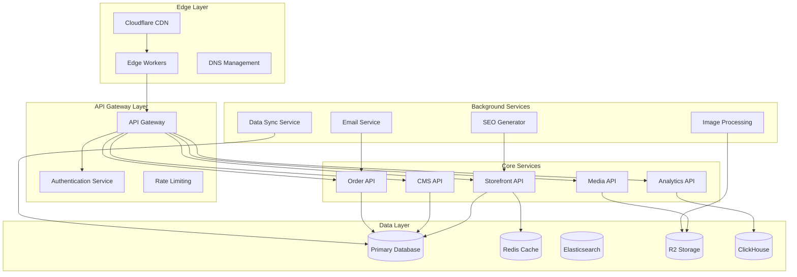
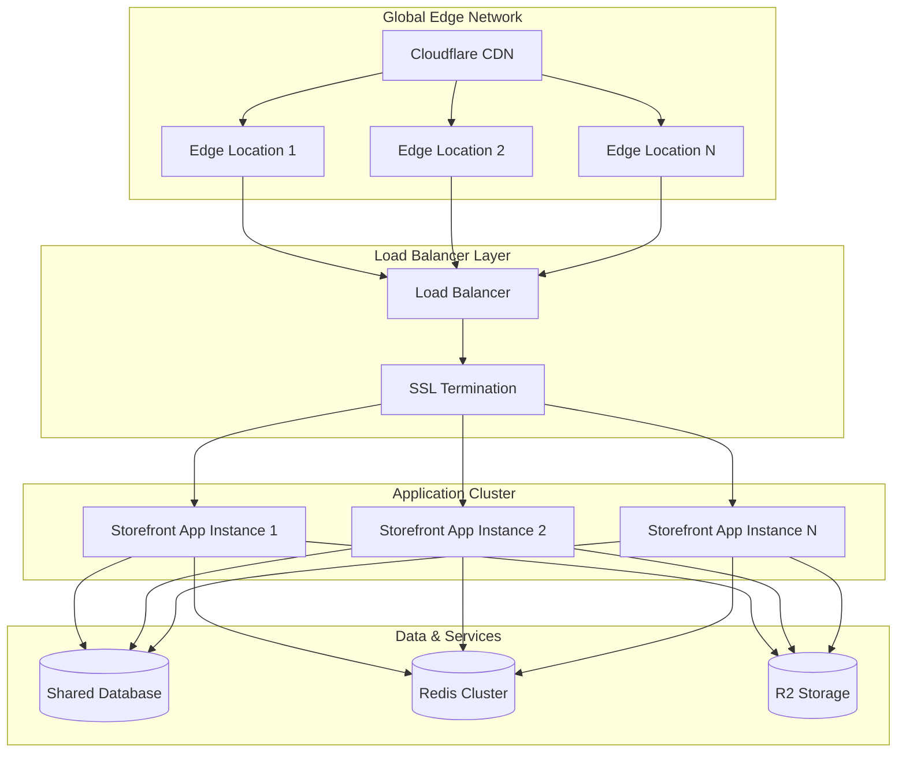

# Design Document

## Overview

The CMS-powered storefront system is a multi-tenant SaaS platform that enables TAR POS users to create and manage e-commerce websites. The system leverages a microservices architecture with edge computing to support millions of users, each with custom domains. The design emphasizes real-time data synchronization, scalable content delivery, and a flexible block-based content management system.

## Architecture

### High-Level Architecture



### Multi-Tenant Architecture

The system uses a hybrid multi-tenancy approach:
- **Database Level**: Shared database with tenant isolation through row-level security
- **Application Level**: Tenant context propagated through all services
- **Infrastructure Level**: Shared infrastructure with tenant-specific configurations

### Domain Management Strategy

Each storefront can have:
1. **Default Subdomain**: `{username}.tarpos.store`
2. **Custom Domain**: User-provided domain with automatic SSL
3. **Domain Verification**: DNS verification process for custom domains
4. **SSL Management**: Automatic certificate provisioning via Let's Encrypt

### Storefront Deployment Strategy

**Multi-Tenant Single Application Approach**:
- All storefronts run on a single, horizontally scalable application
- Dynamic routing based on domain/subdomain to identify tenant
- Shared infrastructure with tenant-specific content rendering
- Edge caching for optimal performance across regions

**Deployment Architecture**:


**Request Flow**:
1. Customer visits `customer-store.com` or `username.tarpos.store`
2. DNS resolves to Cloudflare CDN
3. Cloudflare routes to nearest edge location
4. Edge worker identifies tenant from domain
5. Cached content served from edge, or request forwarded to origin
6. Load balancer routes to available application instance
7. Application renders tenant-specific content
8. Response cached at edge for future requests

**Scaling Strategy**:
- **Horizontal Scaling**: Auto-scaling application instances based on load
- **Database Scaling**: Read replicas and connection pooling
- **Cache Scaling**: Redis cluster with automatic failover
- **CDN Scaling**: Global edge network handles traffic spikes
- **Storage Scaling**: Cloudflare R2 provides unlimited scalable storage

## Components and Interfaces

### 1. Storefront Rendering Engine

**Purpose**: Server-side rendering of storefronts with optimal performance

**Key Features**:
- Static site generation for product pages
- Dynamic rendering for personalized content
- Edge-side includes for real-time data
- Progressive web app capabilities

**Interface**:
```typescript
interface StorefrontRenderer {
  renderPage(tenantId: string, path: string, context: RenderContext): Promise<RenderedPage>
  generateStaticPages(tenantId: string): Promise<StaticPage[]>
  invalidateCache(tenantId: string, paths: string[]): Promise<void>
}

interface RenderContext {
  user?: User
  cart?: Cart
  device: DeviceInfo
  location?: GeoLocation
}
```

### 2. Block Management System

**Purpose**: Flexible content block system with code-based customization

**Block Types**:
- **Vibe Code Blocks**: Custom JavaScript/TypeScript code with React components
- **Template Blocks**: Pre-built blocks (Hero, Product Grid, Gallery) with vibe code customization
- **Hybrid Blocks**: Visual editor with vibe code override capability

**Vibe Code System**:
- Users write React component code that gets stored in InstantDB
- Code is executed in a secure sandbox environment
- Access to storefront data (products, collections, cart) via provided APIs
- Real-time preview in the block editor
- Version control for block code changes

**Interface**:
```typescript
interface Block {
  id: string
  type: BlockType
  vibeCode?: string // React component code
  config: BlockConfig
  position: number
  visibility: VisibilityRules
  codeVersion: number
  lastCodeUpdate: Date
}

interface VibeCodeBlock extends Block {
  vibeCode: string
  dependencies: string[] // Allowed npm packages
  props: Record<string, any> // Props passed to component
  sandbox: SandboxConfig
}

interface BlockRenderer {
  render(block: Block, context: RenderContext): Promise<string>
  executeVibeCode(code: string, props: any, context: RenderContext): Promise<string>
  validateVibeCode(code: string): CodeValidationResult
  getAvailableAPIs(): APIReference[]
}

interface CodeValidationResult {
  isValid: boolean
  errors: CodeError[]
  warnings: CodeWarning[]
  securityIssues: SecurityIssue[]
}
```
```

### 3. Content Management API

**Purpose**: CRUD operations for all content types

**Endpoints**:
- `/api/cms/pages` - Page management
- `/api/cms/blocks` - Block operations
- `/api/cms/posts` - Blog post management
- `/api/cms/media` - Media library
- `/api/cms/themes` - Theme management

**Interface**:
```typescript
interface CMSService {
  createPage(tenantId: string, page: PageData): Promise<Page>
  updatePage(tenantId: string, pageId: string, updates: Partial<PageData>): Promise<Page>
  publishPage(tenantId: string, pageId: string): Promise<void>
  getPageBlocks(tenantId: string, pageId: string): Promise<Block[]>
  updateBlocks(tenantId: string, pageId: string, blocks: Block[]): Promise<void>
}
```

### 4. Real-time Synchronization Service

**Purpose**: Sync data between POS and storefront systems

**Sync Strategy**:
- Event-driven synchronization using message queues
- Conflict resolution for concurrent updates
- Incremental sync for large datasets
- Real-time WebSocket updates for live data

**Interface**:
```typescript
interface SyncService {
  syncProducts(tenantId: string, productIds?: string[]): Promise<SyncResult>
  syncInventory(tenantId: string, locationId?: string): Promise<SyncResult>
  syncOrders(tenantId: string, orderIds?: string[]): Promise<SyncResult>
  subscribeToChanges(tenantId: string, callback: ChangeCallback): Subscription
}
```

### 5. Vibe Code Execution Engine

**Purpose**: Secure execution of user-written JavaScript functions for HTML generation in Cloudflare Workers

**Execution Environment**:
- **Worker-Native Runtime**: Direct JavaScript execution in Cloudflare Workers V8 isolates
- **HTML Template Functions**: Simple functions that return HTML strings
- **Lightweight Templating**: Template literals with data interpolation
- **API Access Control**: Restricted access to storefront data and functions
- **Resource Limits**: CPU time and memory limits enforced by Workers runtime

**Simple Vibe Code Model**:
```typescript
interface VibeCodeSandbox {
  executeCode(code: string, data: any, context: WorkerContext): Promise<string>
  validateCode(code: string): SecurityValidation
  getAllowedAPIs(): APIWhitelist
  getResourceLimits(): ResourceLimits
}

interface WorkerContext {
  storefront: StorefrontData
  products: Product[]
  collections: Collection[]
  cart?: Cart
  user?: User
  device: DeviceInfo
  helpers: TemplateHelpers
}

interface TemplateHelpers {
  formatPrice: (amount: number, currency: string) => string
  formatDate: (date: Date, format: string) => string
  slugify: (text: string) => string
  escapeHtml: (text: string) => string
  generateId: () => string
}

interface APIWhitelist {
  // Simple data access - no complex operations
  getProducts: (filters?: ProductFilters) => Product[]
  getCollections: () => Collection[]
  getCart: () => Cart
  // Utility functions
  formatPrice: (amount: number, currency: string) => string
  formatDate: (date: Date, format: string) => string
}

interface ResourceLimits {
  maxExecutionTime: number // 1 second (Workers limit)
  maxMemoryUsage: number // 128MB (Workers limit)
  maxStringLength: number // 1MB output HTML
}
```

**Vibe Code Examples**:
```javascript
// Simple product grid
function renderProductGrid(products, helpers) {
  return `
    <div class="grid grid-cols-3 gap-4">
      ${products.slice(0, 6).map(product => `
        <div class="border rounded-lg p-4">
          
          <h3>${helpers.escapeHtml(product.name)}</h3>
          <p>${helpers.formatPrice(product.price, 'USD')}</p>
          <button onclick="addToCart('${product.id}', 1)">Add to Cart</button>
        </div>
      `).join('')}
    </div>
  `;
}

// Hero section with dynamic content
function renderHero(storefront, helpers) {
  return `
    <section class="hero bg-gradient-to-r from-blue-500 to-purple-600 text-white py-20">
      <div class="container mx-auto text-center">
        <h1 class="text-4xl font-bold mb-4">${helpers.escapeHtml(storefront.name)}</h1>
        <p class="text-xl mb-8">${helpers.escapeHtml(storefront.tagline)}</p>
        <a href="/products" class="bg-white text-blue-600 px-8 py-3 rounded-lg font-semibold">
          Shop Now
        </a>
      </div>
    </section>
  `;
}
```

**Code Validation**:
- **AST Parsing**: Detect dangerous patterns (eval, Function constructor, etc.)
- **Function Signature**: Ensure function returns string and accepts correct parameters
- **No Imports**: No require/import statements allowed
- **Safe Operations**: Only safe JavaScript operations permitted

### 6. E-commerce Engine

**Purpose**: Handle shopping cart, checkout, and order processing

**Features**:
- Shopping cart management with persistence
- Multi-payment gateway support
- Tax calculation and shipping
- Order fulfillment workflow
- Customer account management

**Interface**:
```typescript
interface EcommerceService {
  addToCart(sessionId: string, item: CartItem): Promise<Cart>
  calculateTotals(cart: Cart, shippingAddress: Address): Promise<OrderTotals>
  processPayment(orderId: string, paymentData: PaymentData): Promise<PaymentResult>
  fulfillOrder(orderId: string, fulfillmentData: FulfillmentData): Promise<Order>
}
```

## Data Models

### Core Entities

```typescript
// Storefront Configuration
interface Storefront {
  id: string
  tenantId: string
  domain: string
  customDomain?: string
  theme: ThemeConfig
  settings: StorefrontSettings
  status: 'active' | 'inactive' | 'suspended'
  createdAt: Date
  updatedAt: Date
}

// Page Structure
interface Page {
  id: string
  storefrontId: string
  slug: string
  title: string
  metaDescription?: string
  blocks: Block[]
  isPublished: boolean
  publishedAt?: Date
  seoConfig: SEOConfig
}

// Content Block with Vibe Code Support
interface Block {
  id: string
  type: BlockType
  vibeCode?: string // React component code
  config: Record<string, any>
  position: number
  visibility: {
    devices: ('desktop' | 'tablet' | 'mobile')[]
    userTypes: ('guest' | 'customer')[]
    dateRange?: { start: Date; end: Date }
  }
  codeVersion: number
  lastCodeUpdate: Date
  dependencies: string[] // Allowed npm packages
}

// Product Extension for Storefront
interface StorefrontProduct extends Product {
  seoTitle?: string
  seoDescription?: string
  featuredImage?: string
  gallery: string[]
  relatedProducts: string[]
  customFields: Record<string, any>
}

// Order with Storefront Context
interface StorefrontOrder extends Order {
  storefrontId: string
  customerNotes?: string
  shippingMethod: ShippingMethod
  trackingNumber?: string
  fulfillmentStatus: FulfillmentStatus
}
```

### Database Schema Extensions

```sql
-- Storefronts table
CREATE TABLE storefronts (
  id UUID PRIMARY KEY DEFAULT gen_random_uuid(),
  tenant_id UUID NOT NULL REFERENCES tenants(id),
  domain VARCHAR(255) UNIQUE NOT NULL,
  custom_domain VARCHAR(255) UNIQUE,
  theme_config JSONB NOT NULL DEFAULT '{}',
  settings JSONB NOT NULL DEFAULT '{}',
  status VARCHAR(20) NOT NULL DEFAULT 'active',
  created_at TIMESTAMP WITH TIME ZONE DEFAULT NOW(),
  updated_at TIMESTAMP WITH TIME ZONE DEFAULT NOW()
);

-- Pages table
CREATE TABLE pages (
  id UUID PRIMARY KEY DEFAULT gen_random_uuid(),
  storefront_id UUID NOT NULL REFERENCES storefronts(id),
  slug VARCHAR(255) NOT NULL,
  title VARCHAR(255) NOT NULL,
  meta_description TEXT,
  blocks JSONB NOT NULL DEFAULT '[]',
  is_published BOOLEAN DEFAULT false,
  published_at TIMESTAMP WITH TIME ZONE,
  seo_config JSONB NOT NULL DEFAULT '{}',
  created_at TIMESTAMP WITH TIME ZONE DEFAULT NOW(),
  updated_at TIMESTAMP WITH TIME ZONE DEFAULT NOW(),
  UNIQUE(storefront_id, slug)
);

-- Blocks table for vibe code storage
CREATE TABLE blocks (
  id UUID PRIMARY KEY DEFAULT gen_random_uuid(),
  page_id UUID NOT NULL REFERENCES pages(id) ON DELETE CASCADE,
  type VARCHAR(50) NOT NULL,
  vibe_code TEXT, -- React component code
  config JSONB NOT NULL DEFAULT '{}',
  position INTEGER NOT NULL DEFAULT 0,
  visibility JSONB NOT NULL DEFAULT '{"devices": ["desktop", "tablet", "mobile"], "userTypes": ["guest", "customer"]}',
  code_version INTEGER DEFAULT 1,
  last_code_update TIMESTAMP WITH TIME ZONE DEFAULT NOW(),
  dependencies JSONB DEFAULT '[]', -- Allowed npm packages
  created_at TIMESTAMP WITH TIME ZONE DEFAULT NOW(),
  updated_at TIMESTAMP WITH TIME ZONE DEFAULT NOW()
);

-- Posts table for blog functionality
CREATE TABLE posts (
  id UUID PRIMARY KEY DEFAULT gen_random_uuid(),
  storefront_id UUID NOT NULL REFERENCES storefronts(id),
  title VARCHAR(255) NOT NULL,
  slug VARCHAR(255) NOT NULL,
  content TEXT NOT NULL,
  excerpt TEXT,
  featured_image VARCHAR(500),
  author_id UUID REFERENCES users(id),
  status VARCHAR(20) DEFAULT 'draft',
  published_at TIMESTAMP WITH TIME ZONE,
  seo_config JSONB NOT NULL DEFAULT '{}',
  created_at TIMESTAMP WITH TIME ZONE DEFAULT NOW(),
  updated_at TIMESTAMP WITH TIME ZONE DEFAULT NOW(),
  UNIQUE(storefront_id, slug)
);

-- Storefront-specific product extensions
CREATE TABLE storefront_products (
  id UUID PRIMARY KEY DEFAULT gen_random_uuid(),
  storefront_id UUID NOT NULL REFERENCES storefronts(id),
  product_id UUID NOT NULL REFERENCES products(id),
  seo_title VARCHAR(255),
  seo_description TEXT,
  featured_image VARCHAR(500),
  gallery JSONB DEFAULT '[]',
  related_products JSONB DEFAULT '[]',
  custom_fields JSONB DEFAULT '{}',
  is_featured BOOLEAN DEFAULT false,
  sort_order INTEGER DEFAULT 0,
  created_at TIMESTAMP WITH TIME ZONE DEFAULT NOW(),
  updated_at TIMESTAMP WITH TIME ZONE DEFAULT NOW(),
  UNIQUE(storefront_id, product_id)
);
```

## Error Handling

### Error Categories

1. **Validation Errors**: Invalid input data, configuration errors
2. **Authentication Errors**: Unauthorized access, expired tokens
3. **Resource Errors**: Not found, already exists, quota exceeded
4. **System Errors**: Database failures, external service errors
5. **Rate Limiting**: Too many requests, quota exceeded

### Error Response Format

```typescript
interface ErrorResponse {
  error: {
    code: string
    message: string
    details?: Record<string, any>
    timestamp: string
    requestId: string
  }
}
```

### Resilience Patterns

- **Circuit Breaker**: Prevent cascading failures
- **Retry Logic**: Exponential backoff for transient failures
- **Graceful Degradation**: Fallback to cached content
- **Health Checks**: Monitor service availability
- **Timeout Management**: Prevent hanging requests

## Testing Strategy

### Testing Pyramid

1. **Unit Tests**: Individual component testing
   - Block rendering logic
   - Data transformation functions
   - Validation rules
   - Business logic services

2. **Integration Tests**: Service interaction testing
   - API endpoint testing
   - Database operations
   - External service integration
   - Real-time sync functionality

3. **End-to-End Tests**: Complete user journey testing
   - Storefront creation workflow
   - Content management operations
   - Customer shopping experience
   - Order processing flow

4. **Performance Tests**: Scalability and load testing
   - Concurrent user simulation
   - Database performance under load
   - CDN cache effectiveness
   - API response times

### Test Data Management

- **Tenant Isolation**: Separate test data per tenant
- **Seed Data**: Consistent test datasets
- **Data Cleanup**: Automated cleanup after tests
- **Mock Services**: External service mocking

### Monitoring and Observability

- **Application Metrics**: Response times, error rates, throughput
- **Business Metrics**: Storefront creation rate, order conversion
- **Infrastructure Metrics**: CPU, memory, database performance
- **User Experience Metrics**: Page load times, bounce rates
- **Real-time Dashboards**: Grafana dashboards for monitoring
- **Alerting**: PagerDuty integration for critical issues